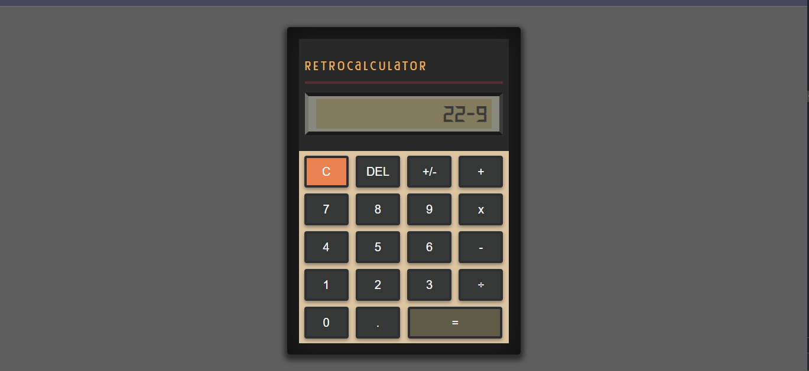

# RetroCalculator

The objective of this project is to build a functional calculator to practice a little more the basics of programming, which are HTML, CSS and JavaScript.

## 🛠️ Tecnologias
- HTML;
- CSS;
- JavaScript;
- Git e GitHub.

## 📞 Contate-me
Linkedin: [Lara Vitória](https://www.linkedin.com/in/laravitoria/)
 
Email: larahvitoria15@gmail.com

Inspired by Rocketseat #boraCodar challenge 💜
